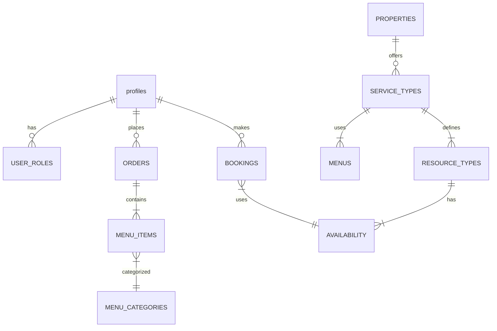

# Hospitality Management Suite

A React Native application enabling hotels and restaurants to manage guest experiences including accommodation booking, dining reservations, and event hosting.

## Features

### Core Functionality
- **Accommodation Booking**
  - Room selection with real-time availability
  - Interactive calendar for date selection
  - Dynamic pricing based on demand
  
- **Dining & Catering**
  - Menu browsing with hierarchical categories
  - Customizable meal options
  - Table reservation system
  
- **Event Hosting**
  - Conference hall booking
  - Equipment rental management
  - Package deals (rooms + events)

### Supporting Systems
- **User Management**
  - Guest/staff roles with RBAC
  - Supabase authentication
  - Profile customization
  
- **Payment Processing**
  - Stripe integration
  - Secure transaction handling
  - Refund management
  
- **Notifications**
  - Booking confirmations
  - Order status updates
  - Payment receipts

## Technical Architecture

### Database Schema


**Entity Definitions:**
1. `profiles`
   - *Core Fields*: 
     - `id` (Primary key, references auth.users)
     - `updated_at`
     - `username` (Unique)
     - `full_name`
     - `avatar_url`
     - `website`
   - *Constraints*:
     - `username_length` (char_length(username) >= 3)
   - *Hospitality Additions*:
     - `contact_number`
     - `preferred_language`
     - `dietary_restrictions`
     - `loyalty_points`
   - *Relationships*:
     - One-to-many with `user_roles`
     - One-to-many with `bookings`
     - One-to-many with `orders`

2. `USER_ROLES`
   - Defines permissions (guest, staff, admin, property_manager)
   - Role-specific access controls

3. `PROPERTIES`
   - Location metadata
   - Service offerings
   - Operational hours
   - **Types**: hotel, restaurant, venue, resort, lodging

4. `SERVICE_TYPES`
   - Accommodation
   - Dining
   - Events
   - Comprehensive (multiple services under one roof)

5. `RESOURCE_TYPES`
   - Accommodation: Room types, amenities
   - Dining: Table configurations, meal services
   - Events: Venue capacities, equipment

6. `AVAILABILITY`
   - Time slots
   - Pricing models
   - Capacity constraints

7. `BOOKINGS`
   - Reservation lifecycle
   - Guest details
   - Resource assignments

8. `ORDERS`
   - Fulfillment status
   - Order items
   - Payment linkage

9. `MENUS`
   - Service-specific offerings
   - Category hierarchy
   - Pricing tiers

10. `PROPERTY_MANAGERS`
   - Links users to properties they manage
   - *Fields*:
     - `user_id` (FK to profiles)
     - `property_id` (FK to properties)
     - Timestamps
   - *Constraints*: Unique (user_id, property_id)

### Business Rules
- **Booking Management**
  - Minimum stay requirements
  - Cancellation policies
  - Automated cleanup of expired holds

- **Order Processing**
  - Customization constraints
  - Preparation time estimation
  - Allergy alert system

- **Security Protocols**
  - Row-level security (RLS)
  - Payment data encryption
  - Audit logging

### Security Policies
1. Row-level security for data isolation
2. Auth integration with Supabase
3. Payment data encryption
4. Audit trails for all transactions
5. **Role management restrictions**:
   - Users cannot modify their own roles
   - Only administrators can assign/update roles
   - Role changes require administrative privileges

## Development Setup

### Prerequisites
- Node.js v18+
- Expo CLI
- Supabase account
- Stripe developer account

### Installation
```bash
git clone https://github.com/your-repo/hospitality.git
cd hospitality
npm install
cp .env.example .env
```

### Configuration
1. Update `.env` with your Supabase credentials
2. Configure Stripe keys in `src/config/payments.js`
3. Run migrations: `npx supabase migration up`

### Running the App
```bash
# Start development server
expo start
```

## Roadmap

### Q3 2025
- [ ] Dynamic package builder
- [ ] Multi-property support

### Q4 2025
- [ ] Inventory management
- [ ] Staff assignment system

### Future Enhancements
- AI-powered recommendation engine
- Integrated loyalty program
- AR room previews
